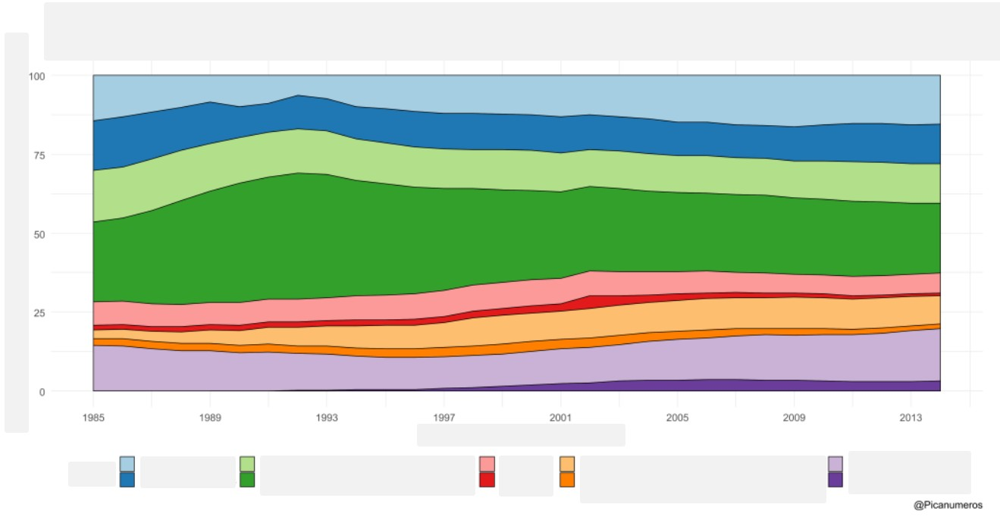

---
title-slide-attributes:
- data-background-image: /assets/intro.jpg
- data-background-size: cover
- data-background-opacity: 0.18
- data-background-color: aquamarine
title: Gráficos que se revelan lentamente
subtitle: Slow Reveal Graphs
author: <a href="www.tierradenumeros.com">Pablo Beltrán-Pellicer </a>    <a href="https://twitter.com/pbeltranp">@pbeltranp</a>
rollingLinks: true
description: Elección de carreras universitarias por género. Materiales distribuidos bajo licencia CC-BY-SA-4.0 
---

## Gráficos que se revelan lentamente {data-background-image="assets/images/stats2.jpg" data-background-opacity="0.06"}

¿Qué observas? Intenta ir contestando mentalmente a las preguntas.

{width=100%}

## Gráficos que se revelan lentamente {data-background-image="assets/images/stats2.jpg" data-background-opacity="0.06"}

Esta nueva información, ¿qué añade o cambia a lo que pensabas?

{width=100%}

## Gráficos que se revelan lentamente {data-background-image="assets/images/stats2.jpg" data-background-opacity="0.06"}

¿Y ahora?

{width=100%}

## Gráficos que se revelan lentamente {data-background-image="assets/images/stats2.jpg" data-background-opacity="0.06"}

¿Qué observas? ¿Qué te preguntas?

{width=100%}

## Gráficos que se revelan lentamente {data-background-image="assets/images/stats2.jpg" data-background-opacity="0.06"}

¿Qué podemos preguntarnos? ¿Intuimos qué puede estar mostrando este gráfico?

{width=100%}

## Gráficos que se revelan lentamente {data-background-image="assets/images/stats2.jpg" data-background-opacity="0.06"}

Solo nos falta qué significa el eje vertical y lo más importante, de qué va el gráfico.

{width=100%}

## Gráficos que se revelan lentamente {data-background-image="assets/images/stats2.jpg" data-background-opacity="0.06"}

¿Podemos decir ya qué nos está mostrando el gráfico?

{width=100%}

## Gráficos que se revelan lentamente {data-background-image="assets/images/stats2.jpg" data-background-opacity="0.06"}

¿Cuándo has empezado a pensar que el gráfico iba sobre elección de carreras universitarias por género?

{width=100%}

# Créditos y referencias {data-background-image="assets/credits.jpg" data-background-opacity="0.1"}

## Lista de referencias {data-background-image="assets/credits.jpg" data-background-opacity="0.1"}

- Fuente del gráfico original: [\@picanumeros](https://picanumeros.wordpress.com/2019/12/09/brecha-de-genero-en-los-estudios-evolucion-del-de-mujeres-matriculadas-en-carreras-universitarias-publicas-desde-1985-a-2014/)
- Si te interesa saber más sobre este tipo de actividades: [Slow Reveal Graphs](https://slowrevealgraphs.com/), gestionada por [\@jennalaib](https://twitter.com/jennalaib).

## Créditos {data-background-image="assets/credits.jpg" data-background-opacity="0.1"}

_Compartir el conocimiento de forma libre es una buena práctica._

En estas diapositivas se han utilizado materiales disponibles en abierto y se han citado las fuentes correspondientes. El contenido de la presentación está publicado con licencia Creative Common [CC-BY-SA-4.0](https://creativecommons.org/licenses/by-sa/4.0/legalcode.es), lo que quiere decir que puedes compartirla y adaptarla, citándome (Pablo Beltrán-Pellicer) y poniendo un enlace a la presentación.

_Siéntete libre de trabajar con este material y de contactar conmigo para compartir tus reflexiones._

## {data-background-image="assets/credits.jpg" data-background-opacity="0.1"}

Presentación realizada con  <a href="https://revealjs.com/#/">Reveal.js</a>, <a href="https://pandoc.org/">Pandoc</a>, <a href="https://www.mathjax.org/">MathJax</a> y <a href="https://www.markdownguide.org/">Markdown</a>. El código fuente está disponible en [https://github.com/pbeltran](https://github.com/pbeltran/)

La fuente de las imágenes es propia, salvo las que se ha citado la fuente en su diapositiva y las de dominio público obtenidas en [Unsplash](https://unsplash.com).

